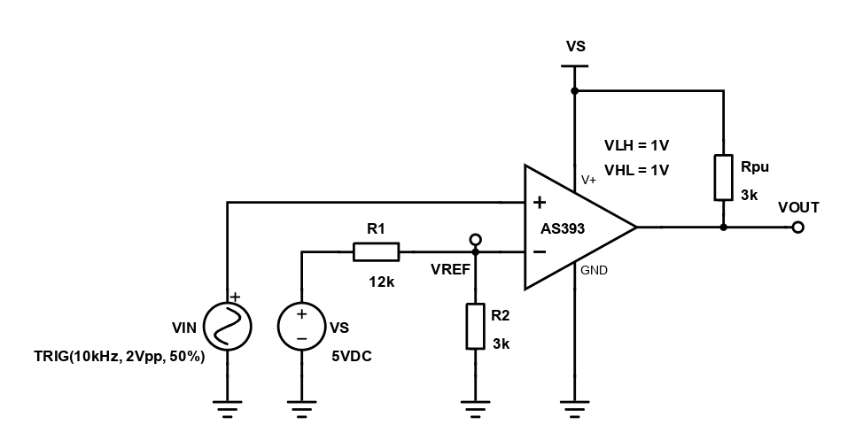
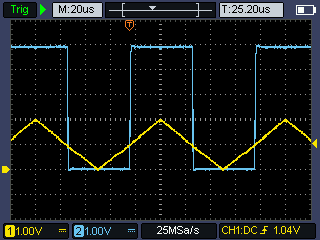
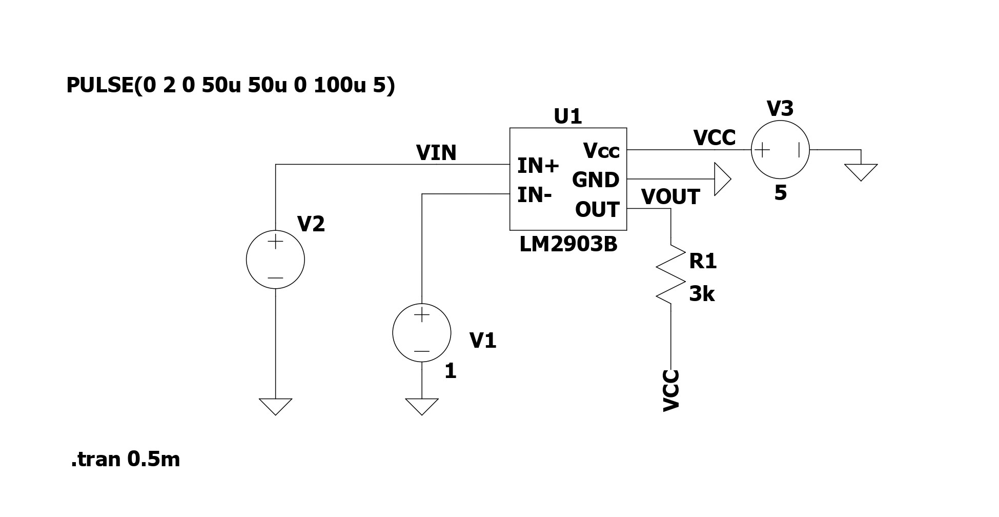
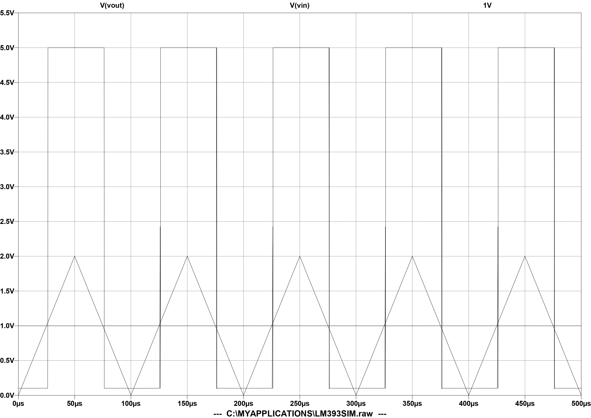

# Experimenting with comparators 
I got myself some open-drain/open-collector comparators AS393 and decided to build some circuits. This document logs my dabble in comparator circuit design.

## Simple comparator 
The AS393/LM393 can be employed as a non-hysteretic comparator, meaning that there is no hsyteresis applied to the comparator (besides an internal hysteresis of a few milivolts). As a result of this lack of hysteresis, 
the comparator will not have high noise immunity and comparator "chatter" may be present in the switching characteristic of the circuit. 

The circuit presented below follows a simple logic, a bare comparator has its inverting input pin fixed at a reference (stable) potential, whilst the non-inverting terminal is left untouched and acts as input to the
voltage comparator. Any fluctuations of the input signal that are above or below the set value of the reference voltage will lead to a state change for the circuit output.

 
  

    
     
     
    <a><b>Basic comparator, with no hysteresis</b></b></a>

 

The comparator presented in the image from above is of the non-inverting flavour, with both the upper and lower trip-voltages being symmetric and positive(to the extent permitted by circuit non-idealities).

Such a circuit was built and tested on a simple breadboard. The input signal is a 10kHz, 2Vpp triangular (50% simmetry ramp) fed by onboard function generator of handheld scope HDS242S. The reference is set by a simple
1 to 5 voltage divider connected to the overall power supply, this averages out to around a 1V. 

 
  

    
     
     
    <a><b>Input and output of simple comparator circuit</b></b></a>

 

The trip voltages may be easily observed and verified, the non-inverting nature of the circuit can also be easily deduced from the scope plot. While all this is pretty nice and useful, there are some glaring 
performance issues:
- Comparator chatter due to imperfect, noise-inducing power supply
- Delay and response times messing with our trip voltages

The circuit can and will be improved by adding hysteresis to the bare comparator, but this will be done in another log.

For fun, we may simulate the same circuit in LTspice, with the spice model of the similar LM393, the only commercialized flavour of 393 that had a proper spice model.

 
  

    
     
     
    <a><b>Basic comparator schematic</b></b></a>

 

 
  

    
     
     
    <a><b>Basic comparator simulation result</b></b></a>

 

The simulations are true to the real deal:
- Chatter in the vicinity of trip voltages
- Propagation delays
- Rise times and more

After analysing this type of circuit, one thing is clear, for trigger-happy environments hsyteresis is a fundamental requirement.
