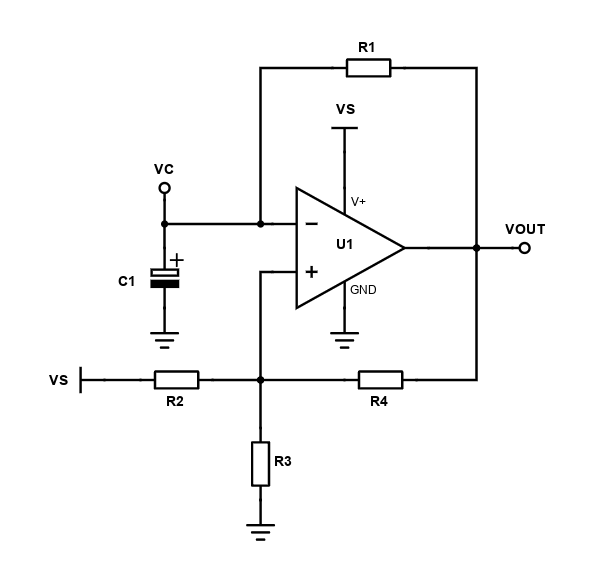
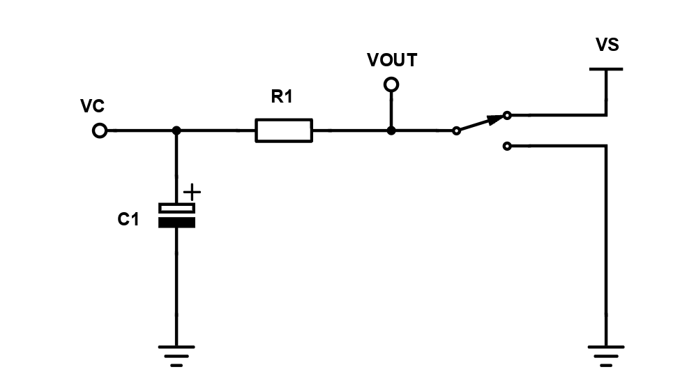

# Comparator-based Relaxation Oscillator
This projects covers the theory behind using a comparator (or a really fast op-amp) as a foundation for a relaxation oscillator. Such oscillators have many uses, some more frequent ones being:
- Clock generator for digital systems
- PWM generation
## Brief introduction
This type of relaxation oscillator is centered on a simple comparator IC and is formed from two main functional blocks:
- Inverting comparator
- RC-timing network

This is how the basic circuit looks like:

 
  

    
     
     
    <a><b>Relaxation oscillator basic circuit</b></b></a>

 

This oscillator is designed for use with single channel power supplies. A simpler version, with only two resistors in the positive feedback path can be used when a dual channel power supply is available and both positive and negative output voltages are to be desired.

## Threshold voltages 
We need to obtain the UTP and LTP of the inverting comparator contained within the relaxation oscillator. We will take into account two possible output states: 
-  Output goes to supply voltage, $V_{S}$
-  Output goes to GND

When $V_{out}=V_{S}$, $R_{2}$ will be in parallel with $R_{4}$. The two parallel resistor will form a voltage divider with $R_{3}$. 
The resulting formula for the UTP (here denoted as VL) is:

$$V_{L}=\frac{R_{3}}{\(R_{2}||R_{4}\)+R_{3}}\cdot V_{S}$$

When $V_{out}=GND$, $R_{3}$ and $R_{4}$ will be in parallel. The two resistors will form a voltage divider with $R_{2}$.
For LTP (here denoted as VH) the formula will be:
$$V_{H}=\frac{R_{3}||R_{4}}{\(R_{3}||R_{4}\)+R_{2}}\cdot V_{S}$$

Practical oscillator circuits of this type employ resistors with the same (high) values in the positive feedback path. Such a choice in component selection leads to simpler forms for our threshold voltages:

$$V_{L}=\frac{2}{3}\cdot V_{S}$$

$$V_{H}=\frac{1}{3}\cdot V_{S}$$

## Oscillator frequency
Our relaxation oscillator is built upon an RC-timing network, it is vital that we understand how this network's capacitor charges and discharges, as a function of predefined thresholds and output voltages.

We may simplify the original comparator circuit to a first-order switched RC circuit, as we can see below:

 
  

    
     
     
    <a><b>Useful switch analogy for understanding the workings of the RC timing network</b></a>

 

The SPDT switch simulates the switch between output values. When the inverting terminal of the comparator is higher than the non-inverting terminal, the comparator's output will go to GND. conversely, when the "+" terminal is higher than the "-" terminal, the output voltage will be the supply voltage ($V_{S}$).

When the switch goes to GND the capacitor will start descharging, until it reaches a lower threshold and the comparator output once again flips back to supply voltage. The reverse, for a higher threshold, happens when the output goes to supply voltage, with the capacitor charging up. Given the fact that our capacitor is pre-charged, the initial conditions of the circuit (and of the characteristic differential equations) are not zero, special care must be taken to ensure that the formulas we use take into account the initial capacitor voltage.

$$\begin{gather}
V_{S}= I\cdot R + V_{C}\\
\\
V_{S}=R\\;C\cdot \frac{d V_{C}}{dt}+V_{C}\\
\\
\int_{0}^{t} \frac{dt}{R\\;C}=\int_{V_{ini}}^{V_{C}}\frac{dV_{C}}{V_{S}-V_{C}}\\
\\
\frac{t}{R\\;C}=-\ln{V_{S}-V_{C}}+\ln{V_{S}-V_{ini}}=-\ln{\frac{V_{S}-V_{C}}{V_{S}-V_{ini}}}\\
\\
V_{C}(t)=V_{S}-\(V_{S}-V_{ini}\)\cdot e^{\frac{-t}{R\\;C}}
\end{gather}$$

The formula for charging the capacitor is given as:

$$\boxed{V_{C}(t)=V_{S}-\(V_{S}-V_{ini}\)\cdot e^{\frac{-t}{R\\;C}}}$$

A similar formula can be obtained for discharging the capacitor:

$$\boxed{V_{C}(t)=V_{ini}\cdot e^{\frac{-t}{R\\;C}}}$$

When charging the cap, the initial voltage will be $V_{L}$, whilst for the discharge the initial voltage will be $V_{H}$. By doing some simple substitutions we will obtain the formulas for the charge and discharge times:

$$t_{h}=R\\;C\cdot \ln{\frac{V_{L}-V_{S}}{V_{H}-V_{S}}}$$

$$t_{l}=R\\;C\cdot \ln{\frac{V_{H}}{V_{L}}}$$

The resulting period of oscillation is given by the sum of the charging and discharging times.

$$\begin{gather}
T = t_{h}+t_{l} = R\\;C\cdot \ln{\frac{V_{S}-V_{L}}{V_{S}-V_{H}}} + R\\;C\cdot \ln{\frac{V_{H}}{V_{L}}}\\
\\
T = R\\;C\cdot \ln{\frac{V_{S}-V_{L}}{V_{S}-V_{H}}\cdot \frac{V_{H}}{V_{L}}}\\
\end{gather}$$

A special case for the two threshold voltages will yield a simpler expression, for $V_{S}=V_{L}+V_{H}$ we may write:

$$\begin{gather}
T = R\\;C\cdot\ln{\frac{V_{H}^{2}}{V_{L}^{2}}=2\cdot R\\;C\cdot\ln{\frac{V_{H}}{V_{L}}}}\\
\end{gather}$$

The resulting oscillation frequency is:

$$\boxed{F_{osc} = \frac{1}{2\cdot R\\;C\cdot\ln{\frac{V_{H}}{V_{L}}}}}$$

If we assume complementary threshold voltages, like in the case all feedback resistors are identical, the expression for oscillation frequency simplifies to:

$$F_{osc}=\frac{1}{2\cdot R\\;C\cdot 0.693}$$

## Useful design formulas
| Design parameter | Formula                             |
|------------------|-------------------------------------|
| $F_{osc}$        | $\frac{1}{2\cdot R\\;C\cdot 0.693}$ |
| $UTP$            | $\frac{2}{3}\cdot V_{S}$      |
| $LTP$            | $\frac{1}{3}\cdot V_{S}$      |

## Bibliography
-  <a href="https://www.ti.com/lit/ab/snoa998/snoa998.pdf?ts=1709184405633&ref_url=https%253A%252F%252Fwww.google.com%252F">Original (flawed) white paper from TI</a>
-  <a href="https://www.allaboutcircuits.com/technical-articles/exactly-how-schmitt-trigger-oscillators-work/"><b>Exactly How Schmitt Trigger Oscillators Work</b></a>
-  <a href="https://www.youtube.com/watch?app=desktop&v=zxnSvf0Utzw">Derive the Capacitor Charging Equation</a>

